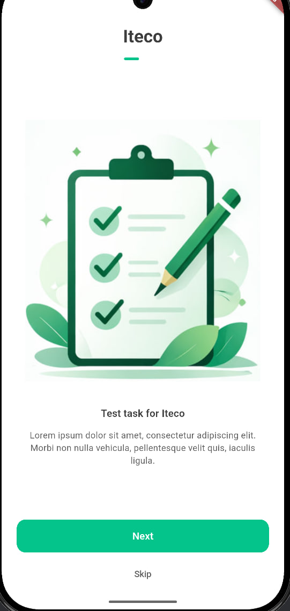
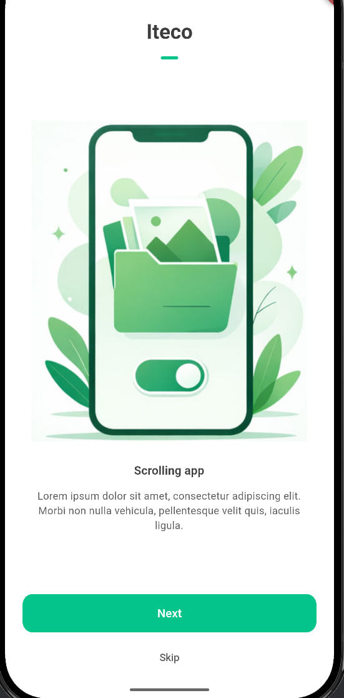
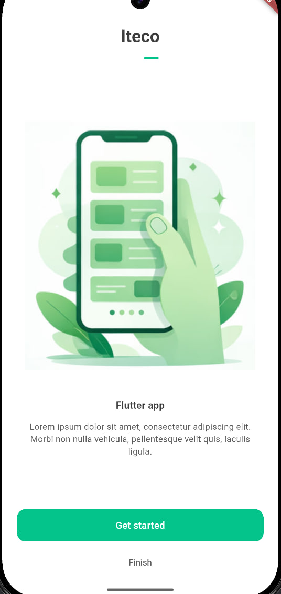
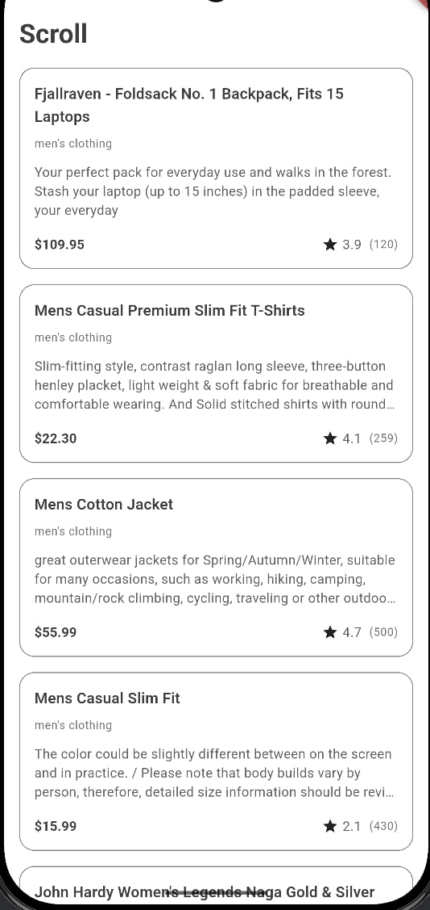

# Iteco Test Task (Flutter)

Мобильное приложение на Flutter с тремя основными экранами:
- Splash Screen
- Onboarding
- Лента товаров с подгрузкой данных из FakeStoreAPI

## Что реализовано

### 1. Splash Screen
- Нативный splash-screen реализован с помощью `flutter_native_splash`
- Дополнительно создан отдельный Flutter-экран загрузки для инициализации приложения и последующей навигации
- При старте отображается экран загрузки (`CircularProgressIndicator`)
- После стартового экрана выполняется переход на онбординг

Файл: `lib/features/splash/splash_screen.dart`

### 2. Onboarding
- Реализован `PageView` из 3 страниц
- Есть индикаторы прогресса, кнопки `Next/Skip` и финальный переход в ленту
- Используются локальные изображения из `assets/images/onboarding/`

Файл: `lib/features/onboarding/onboarding.dart`

### 3. Лента товаров
- Начальная загрузка товаров идет с `https://fakestoreapi.com/products` через `Dio`
- Отрисовка списка через `ListView.builder`
- При скролле вниз триггерится событие подгрузки

Основные файлы:
- `lib/features/scrolling/scrolling_screen.dart`
- `lib/repository/products_repository.dart`
- `lib/bloc/products/*`

## Стек
- Flutter / Dart
- `flutter_bloc` (state management)
- `dio` (network)
- `auto_route` (routing)
- `get_it` (DI)
- `talker` (logging)
- `json_serializable` (model generation)

## Архитектура

Проект построен по feature-based структуре: UI, управление состоянием и работа с данными разделены по слоям.

```
lib/
├── app.dart                     # Корневой виджет приложения
├── main.dart                    # Точка входа
├── bloc.products/               # BLoC для управления состоянием ленты товаров
│   ├── bloc.dart
│   ├── event.dart
│   ├── products.dart
│   └── state.dart
├── core/                        # Базовая конфигурация приложения
│   ├── constants.dart
│   ├── routes.dart
│   └── routes.gr.dart
├── features/                    # UI-модули, организованные по фичам
│   ├── onboarding/
│   │   ├── widgets/
│   │   │   └── TopIndicators.dart
│   │   └── onboarding.dart
│   ├── scrolling/
│   │   ├── widgets/
│   │   │   └── product_card.dart
│   │   └── scrolling_screen.dart
│   └── splash/
│       └── splash_screen.dart
├── models/                      # Модели данных
│   ├── product/
│   │   ├── product.dart
│   │   └── product.g.dart
│   ├── rating/
│   │   ├── rating.dart
│   │   └── rating.g.dart
│   └── slide_data.dart
├── repository/                  # Слой работы с данными и API
│   └── products_repository.dart
└── themes/                      # Тема и стили приложения
    └── themes.dart
```

## Сборка и запуск
### Команды
```bash
flutter pub get
dart run build_runner build --delete-conflicting-outputs
flutter run
```

## Скриншоты

### Splash


### Onboarding




### Product feed



